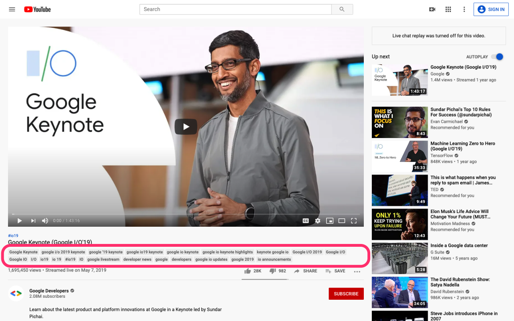

# Video Tag Viewer for YouTube


> Chrome Extension for Viewing Video Tags on YouTube.

## Features

- Display meta tags for current viewing video.

## Screenshots



## Installation

1. Download `extension.zip` from [releases page](https://github.com/fiahfy/youtube-video-tag-viewer/releases) and unzip this file.
2. Open the Extension Management page by navigating to `chrome://extensions`.
3. Enable Developer Mode by clicking the toggle switch next to **Developer mode**.
4. Click the **LOAD UNPACKED** button and select the unpacked directory named `dist`.

## Development

```bash
# install dependencies
yarn

# watch files changed and reload extension
yarn dev
```
